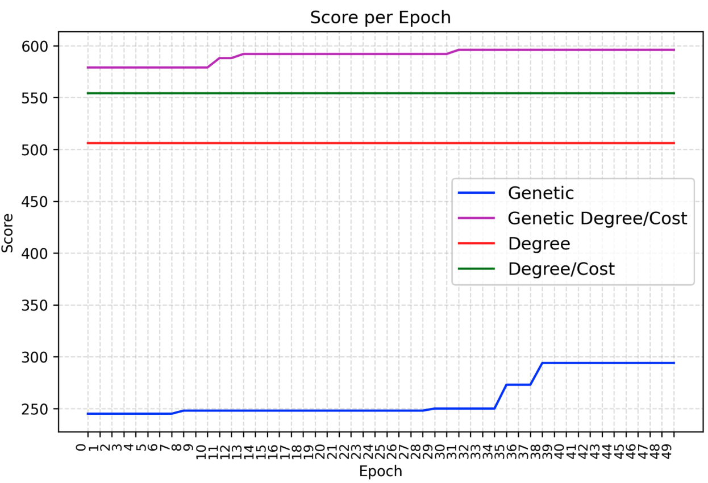

# Cascade Dynamics in Cost Networks

This project compares **4 approaches to Cascade Dynamics in Cost Networks**.

The main focus is on the problem of finding the most influential set of nodes in a network, given a budget constraint, a cost function that assigns a cost to each node, and a threshold function that determines the activation of a node.

The **4 approaches**, which are later discussed in greater details, are:
1. Degree.
2. Degree / Cost.
3. Genetic (random) algorithm.
4. Genetic Degree / Cost algorithm.

## Prerequisites

### Terminology

**Cascade dynamics**: processes where an initial perturbation (such as a failure, activation, or influence spread) propagates through a network, triggering changes in connected nodes.

**Cost networks**: networks where edges or nodes are associated with a cost, which can represent different factors, such as latency and economic cost.

**Cascade dynamics ＋ cost networks**: when cascade dynamics occur in a cost network, the spread of failures or activations must be considered alongside costs.

### Notation

Let
- **G = (V, E)**: a graph where **V** is the set of nodes and **E** is the set of edges.
- **c: V→N**: a cost function that assigns a non-negative integer value **c(v) ∈ { 1, 2, ..., 100 }** to each node **v ∈ V**.
- **t: V→N**: a threshold function that assigns a non-negative integer value **t(v) ∈ { 1, 2, ..., d(v) }** to each node **v ∈ V**.
- **d(v)**: the degree of node **v ∈ V**.
- **S**: the seed set **S** | **|S| = k**.
- **b**: the cost budget for seed sets.
- **sc(S)**: the score of **S** in terms of the number of influenced nodes.

## Approach 1: Degree

The seed set **S** is constructed as **S = { v₁, v₂, ..., vₖ }**, where **vᵢ ∈ V** and **v₁, v₂, ..., vₖ** are the top **k** nodes in **V** sorted in descending order of **d(v)** so that:

- $\sum_{i=1}^{k} c(v_i) \leq b$
- $\sum_{i=1}^{k+1} c(v_i) > b$

Influence the network and compute **sc(S)**.

## Approach 2: Degree / Cost

The seed set **S** is constructed as **S = { v₁, v₂, ..., vₖ }**, where **vᵢ ∈ V** and **v₁, v₂, ..., vₖ** are the top **k** nodes in **V** sorted in descending order of **d(v) / c(v)** so that:

- $\sum_{i=1}^{k} \frac{d(v_i)}{c(v_i)} \leq b$  
- $\sum_{i=1}^{k+1} \frac{d(v_i)}{c(v_i)} > b$

Influence the network and compute **sc(S)**.

## Approach 3: Genetic (random)

### Starting population

This approach begins with a **starting population** of **n ∈ N** seed sets and runs for **e ∈ N** epochs.

The starting seed set **Sₗ** for each **l ∈ { 1, 2, ..., n }** is defined as **Sₗ = { v₁, v₂, ..., vₖ }**, where **vᵢ ∈ V** and:

1. Each **Sₗ** is independently initialized from **P(V)**, where **P(V)** is a random permutation of **V**.
2. **v₁, v₂, ..., vₖ** are taken from **P(V)** while **c(Sₗ) ≤ b**.

### Epochs

During each **epoch eᵢ** where **i ∈ { 1, 2, ..., e }**:  

- Influence the network for each **Sₗ**, and compute **sc(Sₗ)**.  
- Define the population for the epoch **eᵢ + 1** as:  

    - **50% top performers**: Retain the top 50% of **Sₗ** from the current population based on their scores **sc(Sₗ)** in epoch **eᵢ**.  
    - **25% randomly generated**: 25% is generated using the same method as the initial seed sets generation.  
    - **25% combined sets**: 25% is generated using a combination function that combines the top 50% of **Sₗ** based on their scores **sc(Sₗ)** in epoch **eᵢ**.  

### Combination function

A 25% of the new population of epoch **eᵢ + 1** is generated using a combination function that:  
- Takes as input (**S₁**, **S₂**).  
- Produces **S** as output.  

Let:  
- **P₁(V)** and **P₂(V)** be the permutations from which **S₁** and **S₂** were generated.  
- **idxᵢ : V → N**: a function that maps each node **v** to its position in **Pᵢ(V)**.  

The **function**:
1. For each node **v** in **S₁** and **S₂**, computes the average score **$id(v) = \frac{idx_1(v) + idx_2(v)}{2}$**

2. Constructs the permutation **P(V)** by adding nodes sorted in descending order of **id(v)**.  

3. Builds the output **S = { v₁, v₂, ..., vₖ }** by taking nodes from **P(V)** while **c(S) ≤ b**.

## Approach 4: Genetic Degree / Cost

This approach is **almost the same as the genetic approach**: the **main difference is the way the starting population and 25% random sets are generated**.

The starting seed set **Sₗ** for each **l ∈ { 1, 2, ..., n }** is defined as **Sₗ = { v₁, v₂, ..., vₖ }**, where **vᵢ ∈ V** and:

1. Each **Sₗ** is independently initialized from **P(V)**, where **P(V)** is a permutation of **V** built by sorting nodes in descending order of **$\frac{d(v) \cdot \alpha}{c(v) \cdot \beta}$** with **$\alpha, \beta ∈ (0, 1]$**.

2. **v₁, v₂, ..., vₖ** are taken from **P(V)** while **c(Sₗ) ≤ b**.

## Experiments

Experiments are conducted with the following parameters:
- Epochs **e = 50**.
- Starting population **S = { S₁, …, Sₙ }** with **|S| = 20**.
- Cost budget **b = 500**.

Epochs is set to 50 because it is a reasonable number of epochs that allows for a good comparison between the approaches without taking too long to execute.
- Above 50 epochs, there is still improvement over epochs but it happens slowly.

## Results

The most common shape of the results is that the **Genetic Degree / Cost** approach outperforms the other approaches in terms of the number of influenced nodes.

The shape below is achieved on the **/data/email-eu-core** graph with the following stats:
- |V|: 1005.
- |E|: 16706.
- ⍴(G): 0.0331.

Same results are achieved:
- By using the threshold function **t: V→N | t(v) = d(v) / 2** (majority) for each **v ∈ V**.
- When the best element from Genetic Degree/Cost starting population is used as the seed set for Degree/Cost.